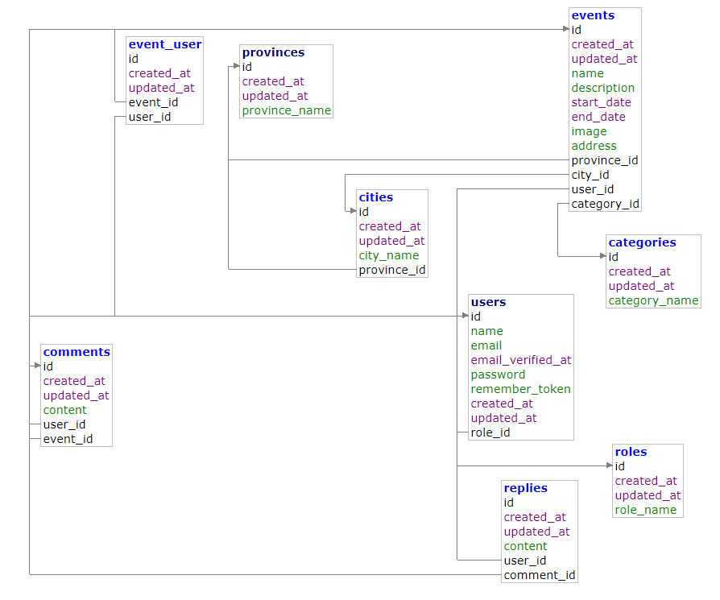

# Eventalia
### Aplicación web para eventos

---

### Índice

- [Eventalia](#eventalia)
    - [Índice](#índice)
  - [0 Introducción](#0-introducción)
  - [1 Objetivo](#1-objetivo)
  - [2 Requisitos](#2-requisitos)
  - [2.1 Funcionales](#21-funcionales)
      - [**Usuario\_Anónimo**](#usuario_anónimo)
      - [**Usuario\_Registrado**](#usuario_registrado)
      - [**Usuario\_Suscriptor**](#usuario_suscriptor)
      - [**Usuario\_Admin**](#usuario_admin)
  - [3 Tecnologías](#3-tecnologías)
    - [3.1 Lenguajes de programación y marcado.](#31-lenguajes-de-programación-y-marcado)
    - [3.2 Servidores](#32-servidores)
    - [3.3 SGBD](#33-sgbd)
    - [3.4 IDEs y editores de texto](#34-ides-y-editores-de-texto)
    - [3.5 Control de versiones](#35-control-de-versiones)
  - [4 Diagrama de clases](#4-diagrama-de-clases)
  - [5 Despliegue](#5-despliegue)

---

## 0 Introducción

Nuestra aplicación es una herramienta que te permite crear y gestionar eventos de manera sencilla y eficiente. Con esta aplicación, podrás organizar eventos de todo tipo, desde conferencias y reuniones hasta fiestas y conciertos. A continuación, te presentamos algunas de las características clave de nuestra aplicación:

- Creación de eventos: Puedes crear eventos personalizados, especificando el título, la fecha, la ubicación y otros detalles relevantes. Además, puedes agregar una descripción del evento y subir imágenes relacionadas.

- Necesidad de realizar la lectura, actualización, creación y eliminación (CRUD: _create_, _update_ _read_ y _delete_).

- Incluir una interfaz usable para la creación de los eventos.

- Disponer de un sistema de almacenamiento de los datos que garantice consistencia, disponibilidad, eficiencia, etc. en las operaciones CRUD.

- Habilitar un disparador que se active cuando el la fecha del evento esta cerca.

- Poder ofrecer ciertos datos relevantes en la toma de decisiones a la hora de asistir a un evento, ver lista o número total de participantes.

- Asignar roles a las diferentes personas que tengan acceso a la aplicación.

## 1 Objetivo

El resultado de este proyecto debiera entregar una aplicación web de eventos. Dicha aplicación deberá ser capaz de resolver las necesidades básicas relacionadas para una persona que quiera buscar y apuntarse a un evento. Dicha aplicación implicará un _front end_ (HTML, CSS y JavaScript) y un _back end_ (PHP, PgSQL), abarcando ambos frentes con el framework de Laravel en la versión 9 _full stack_.

## 2 Requisitos

A continuación se detallan los requisitos funcionales para cada parte interesada y, seguidamente, los requisitos no funcionales y de sistema.

## 2.1 Funcionales

#### **Usuario_Anónimo**

- RF_Usuario_Anónimo_01: Buscar evento

#### **Usuario_Registrado**

- RF_Usuario_Registrado_01: Buscar evento 
- RF_Usuario_Registrado_02: Apuntarse a evento 
- RF_Usuario_Registrado_03: Añadir comentario
- RF_Usuario_Registrado_04: Eliminar su comentario
- RF_Usuario_Registrado_05: Suscribirse

#### **Usuario_Suscriptor**
- RF_Usuario_Suscriptor_01: Buscar evento 
- RF_Usuario_Suscriptor_02: Apuntarse a eventos 
- RF_Usuario_Suscriptor_03: Añadir evento 
- RF_Usuario_Suscriptor_04: Modificar su evento
- RF_Usuario_Suscriptor_05: Eliminar su evento
- RF_Usuario_Suscriptor_06: Añadir comentario

#### **Usuario_Admin**

- RF_Admin_01: Buscar evento
- RF_Admin_02: Añadir evento
- RF_Admin_03: Modificar datos de cualquier evento
- RF_Admin_04: Eliminar cualquier evento
- RF_Admin_05: Eliminar cualquier comentario
- RF_Admin_06: Añadir comentario

## 3 Tecnologías

La aplicación se construye sobre los pilares de las tecnologías listadas a continuación. Se ha tenido en cuenta su idoneidad de acuerdo al objetivo propuesto. El factor común de la gran mayoría es el de contar con licencias de software libre y / o de código abierto.

### 3.1 Lenguajes de programación y marcado.

Como ha sido mencionado anteriormente, este proyecto esta hecho con laravel por tanto hay muchas funcionalidades predefinidas propias de laravel que vamos a utilizar.
- HTML5 y TAILWIND CSS juntocon el motor de plantillas propio de Laravel, BLADE. En el  _front end_ de las páginas web que harán las veces de interfaz con la que se relacionará el cliente.
- JAVASCRIPT, en la utilización de filtros de la aplicación.
- Laravel se encarga de la comunicación entre _front end_ y _back end_ y la creación de páginas web de contenido dinámico, también se encarga de la lógica de  _back end_.
- PGSQL, para todas las partes que implican relación con el SGBD.
- Markdown, para las escrituras provisional y definitiva, respectivamente, de la documentación.

### 3.2 Servidores

- Apache, para desplegar el contenido web.
- Laravel, se encarga de la gestión de la aplicación web, y la relación entre  _front end_ y _back end_.
- Utilizaremos PHP PgSQL, para la base de datos.

### 3.3 SGBD

- PHP PgSQL para la creación, gestión y uso de las bases de datos requeridas por la aplicación.

### 3.4 IDEs y editores de texto

- Dependiendo del contexto han sido utilizados: Visual Studio Code, PHP STORM y Adminer.

### 3.5 Control de versiones

- El sistema de control de versiones del proyecto es `git`, usando como repositorio principal la plataforma GitHub.

### 4 Diagrama de clases

### 5 Despliegue
[Link](http://eventalia.randion.es/)

